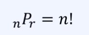
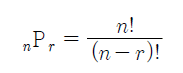
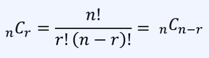
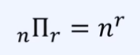
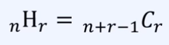

### 확률이란?

- **확률**이란, 특정한 사건이 일어날 가능성을 수로 표현한 것
- 확률은 0부터 1 사이의 실수로 표현됨.

EX. 2022년 월드컵에서 대한민국이 16강에 진출할 확률은 얼마일까?
 => 다른 국가 들보단 전력상 약세이고 이때까지 16강 진출을 2번밖에 안했으니 8%정도 되지 않을까?

---
### 확률이 사용되는 예시
- 자동차 생산 공장에서 불량품을 분류하고 있다고 가정
- 자동차 100대 중 20대가 불량이라고 했을 때
- 새롭게 만들어 진 자동차는 10분의 2 확률로 불량이라고 판단 할 수 있다.

---
### 기계학습 모델을 화률적으로 이해하기
- 일반적으로 기계학습 모델의 출력은 **"확률"** 형태를 띤다.
- N개의 학습 데이터로 기계학습 모델에 사용한다
- 예시 1) 이미지 분류 모델 A가 이미지 x에 대하여 75% 확률로 고양이일 것으로 예측했다. (Vision)
- 예시 2) 글 쓰기 모델 B는 "나는 밥을" 이후에 "먹었다" 라는 단어가 나올 확률을 42%로 예측했다. (NLP)
---
### 경우의 수
- 다양한 문제 상황에서 **확률**을 계산해본다면 기본적으로 경우의 수를 계산할 수 있어야 한다.
- 경우의 수를 계산하는 방법은 **순열**과 **조합**이 있다.
---
### 순열(Permutation)
- 서로 다른 n개에서 r개를 중복 없이 뽑아 특정한 순서로 나열하는 것을 의미한다.
- 모든 순열의 수(경우의 수)는 다음의 공식으로 계산할 수 있다.
1) 순열의 수 공식 (n=r일 때)<br>
2) 순열의 수 공식 (n!=r일 때)<br>
---
### 순열 예시 - 학습에 사용할 이미지의 순서
- 기계 학습 모델 학습을 위해 N개의 학습 데이터로 학습을 진행한다고 가정했을 때
- 매번(epoch) 모델에 학습 데이터를 넣을 순서를 섞어서(shuffle) 학습을 진행한다.
- 에폭(epoch): 학습 데이터 세트에 포함된 모든 데이터가 한 번씩 모델을 통과한 횟수를 말한다.

```python
from itertools import permutations
arr = ['A', 'B', 'C']

result = list(permutations(arr, 2))
print(result)

"""
result
[('A', 'B'), ('A', 'C'), ('B', 'A'), ('B', 'C'), ('C', 'A'), ('C', 'B')]
"""
```

### 조합(Combination)
- 서로 다른 n개에서 r개를 중복 없이 순서를 고려하지 않고 뽑는 것을 의미한다.
- 모든 조합의 수(경우의 수)는 다음의 공식으로 계산할 수 있다.
- 조합의 수 공식 <br>
---
### 조합 예시 - 샴(Siamese) 네트워크
- 딥러닝 아키텍처 중에서 샴 네트워크(Siamese Network)가 있다.
- 두 개의 이미지를 받아서, 두 이미지가 유사하다면 1, 다르다면 0을 출력한다.
- 이때 N개의 이미지로 구성된 데이터 세트가 있을 때, 매번 2개의 이미지를 뽑아서 2개의 이미지를 네트워크의 입력으로 넣는다. 이 경우, 두 이미지에 대하여 순서는 상관 없다.
- 예시) 4개의 이미지가 있을 때, 순서를 고려핮 ㅣ않고 2개의 이미지를 뽑는 경우의 수는?
- 전체 이미지가 {1,2,3,4} 일 때, 가능한 모든 경우는 다음과 같다.
- 모든 경우: [1, 2], [1, 3], [1, 4], [2, 3], [2, 4], [3, 4]
- 경우의 수: 4 * 3 / 2 = 6
```python
from itertools import combinations
arr = ['A', 'B', 'C']

result = list(combinations(arr, 2))
print(result)

"""
result
[('A', 'B'), ('A', 'C'), ('B', 'C')]
"""
```
---
### 중복 순열 (Permutation with Repetition)
- 서로 다른 n개에서 중복을 포함해 r개를 뽑아 특정한 순서로 나열하는 것을 의미한다.
- 모든 중복 순열의 수(경우의 수)는 다음의 공식으로 계산할 수 있다.
- 중복 순열의 수 공식<br>
---
### 중복 순열 예시
- 세 개의 숫자 1, 2, 3을 이용해 만들 수 있는 두자리 자연수의 개수는?
- (단, 같은 숫자를 여러 번 사용하거나, 사용하지 않은 숫자가 있어도 괜찮다.)
- 모든 경우: 11, 12, 13, 21, 22, 23, 31, 32, 33
- 경우의 수: 3**2 = 9
```python
from itertools import product
arr = ['A', 'B', 'C']

result = list(product(arr, repeat=2))
print(result)

"""
result
[('A', 'A'), ('A', 'B'), ('A', 'C'), ('B', 'A'), ('B', 'B'), ('B', 'C'), ('C', 'A'), ('C', 'B'), ('C', 'C')]
"""
```
---
### 중복 조합(Combination with Repetition)
- 서로 다른 n개에서 중복을 포함해 순서를 고려하지 않고 r개를 뽑는 것을 의미함.
- 모든 중복 조합의 수는 다음의 공식으로 계산할 수 있다.
- 중복 조합의 수 공식 <br>
### 중복 조합 예시
- 딥러닝에서는 학습된 여러 모델의 결과를 활용하여 최종적인 결과를 생성하는 앙상블 방법이 존재함.
- 서로 다른 딥러닝 아키텍처 1번, 2번, 3번이 존재한다고 했을 때
- 중복을 허용하여 4개를 골라서 딥러닝 모델 4개를 학습하고자 한다면 가능한 학습의 모든 조합의 수는?
- 단, 같은 아키텍처를 여러 번 사용하거나, 선택하지 않는 아키텍처가 있어도 된다. 
```python
from itertools import combinations_with_replacement
arr = ['A', 'B', 'C']

result = list(combinations_with_replacement(arr, repeat=2))
print(result)

"""
result
[('A', 'A'), ('A', 'B'), ('A', 'C'), ('B', 'B'), ('B', 'C'), ('C', 'C')]
"""
```
---
### 확률(Probability)
- S를 전체 사건의 집합이라고 할 때 사건 X가 일어날 확률 P(X)는 다음과 같다.
- P(X) = 사건 X가 일어나는 경우의 수 / 전체 경우의 수 = n(X)/N(S)
- EX) 1~6까지 숫자가 적힌 정육면체 주사위를 굴렸을 때 숫자 1이 위로 나올 확률은?
- 전체 사건 -> 6 | 1이 나올 확률 -> 1가지 이므로 1/6이다.

### 통계적 확률
동일한 시행을 N번 반복해 사건 X가 발생한 횟수가 R일 때 시행 횟수 N을 무한히 크게 만들면 **R/N이 수렴하는 값을 사건 X의 통계적 확률**이라고 한다.
