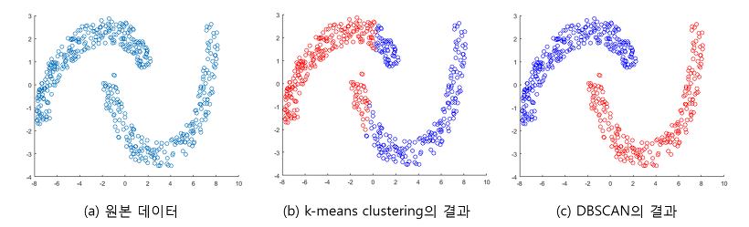

### 클러스터링, 군집화란?
- 데이터가 주어졌을 때, 여러 개의 그룹으로 나누는 것
- 유사한 특성을 가진 그룹을 발견해내는 일
---

### 클러스터링, 군집화의 특성
- <b>내부 멤버들 간의 사이 (Intra-cluster)</b>는 가깝고 <b>그룹 간 사이(inter-cluster)</b>는 멀게 그룹을 만드는 것
- 그룹에 대한 정답이 있으면 분류 문제, 클러스터링은 비지도 학습이므로 어느 그룹에 있는지 정답이 없음.
---

### 클러스터링 사용 예시
1. 유사한 뉴스 그룹으로 묶기 - 문서 군집화
2. 유저가 웹 사이트에서 클릭한 위치의 좌표 정보 (유저 행동 패턴 분석)
3. 유사한 유저군 나누기 - 마켓 세분화 (시장을 적절한 수로 나누고, 각 시장, 타겟 별 효과적인 정책 설정)
4. SNS 관심사 기반 클러스터링
5. 자율 주행 이미지 인식 클러스터링
---

### 클러스터링 종류
클러스터링은 목적과 방법에 따라 다양한 모형 존재, <b>사용법도 다르므로 원하는 목적과 데이터 형태에 따라</b> 맞춰 사용해야함.

<b>Partition-based-Clustering</b>
- 미리 군집(그룹)의 수를 정해두고 클러스터링 하는 방식
- 대표적인 알고리즘으로는 K-means, K-Medoids 등이 있음.

<b>K-means Clustering</b>
- 1) 사용자가 미리 군집수(k)를 정의한다.
- 2) 처음에는 랜덤으로 k개의 중심점(Centroid)를 정한다.
  - 각 군집은 하나의 중심 (centroid)을 가지고 있다.
- 3) 데이터 point를 돌면서 가까운 중심점이 잇는 그룹에 각 데이터를 할당한다.
  - 이때 각 개체 간 거리는 Euclidean distance를 사용한다.
- 4) 모두 그룹을 할당했다면, 각 그룹마다 새 중심점(Centroid) - 클러스터 내 평균점을 새로 구한다.
- 3,4단계를 반복하다가 더 이상 그룹 이동이 일어나지 않으면 멈춘다.

---
<b>Hierarchical based Clustering(합체 군집)</b> 
여러개의 군집 중에서 가장 유사도가 높은 혹은 거리가 가까운 군집 두 개를 선택하여법 하나로 합치면서 군집 개수를 줄여 나가는 방법
agglomerative clustering(합체 군집) 라고도 한다.

가까운 데이터를 서로 묶기 위해서 먼저 각 군집 간 거리를 계산해야 함.

<b>Centroid Distance</b>
- 각 군집의 중심점 사이의 거리를 계산하는 방법
- 계층 클러스터링이 아니더라도 사용할 수 있는 방법

<b>Median Distance</b>
- Hierarchical based Clustering에서 사용할 수 있는 방법
- 군집 u가 군집 s와 군집 t의 결합으로 생성된 군집일때, 중심점을 새로 계산하지 않고 기존 s+t/2를 통해 더 빠르게 계산할 수 있음.

---
<b>Density based Clustering</b>
데이터가 밀집한 정도, 밀도를 이용한 클러스터링 방법

- 군집의 개수를 사용자가 지정할 필요가 없다.
- 초기 데이터로부터 근접한 데이터를 찾아나가는 방법으로 군집을 확장
- 필요한 파라미터는 2가지를 이용하여 "근접하다"를 정의한다.
  - 최소거리 a (다른 점들을 이웃으로 묶기 위해 사용)
  - 최소 데이터 개수 b (밀집 지역으로 정의하기 위함)
- 최소 거리 a 안에 있는 데이터는 이웃이다.
- 최소 거리 a 안에 최소 데이터 개수 b 이상의 데이터가 있으면, 이 데이터를 core로 정의함.
- core 데이터는 하나의 클러스터를 형성하고, 그 core와 a거리 내에 있는 점들을 같은 클러스터로 분류함.

DBSCAN Clustering VS K-means Clustering

[그림 1] Two moons 데이터셋에 대한 k-means 와 DBSAN의 군집화 결과

K-means는 중심점을 기준으로 그룹을 형성하기 때문에, <b>원의 형태</b>로 군집이 만들어짐 
서로 이웃한 데이터들을 같은 클러스터에 포함시키기 때문에 <b>불특정한 모양</b>의 클러스터가 형성

---
### 정답이 없는 클러스터링에 대한 평가 방법리
이미 정답이 있는 분류 문제와 달리 성능 기준을 만들기 어려움

<b> Silhouette Coefficient: 실루엣 계수</b>

- 모든 데이터 쌍 (i, j)에 대한 거리나 dissimilarity를 구한다.
  - a_i : i와 같은 군집에 속한 원소들의 평균 거리
  - b_i : i와 다른 군집 중 가장 가까운 군집까지의 평균 거리

Score = (b_i - a_i) / max(a_i, b_i)

만약 같은 군집 내 평균 거리가 더 가깝다면 양수, 다른 군집과의 거리가 가깝다면 음수가 나옴
